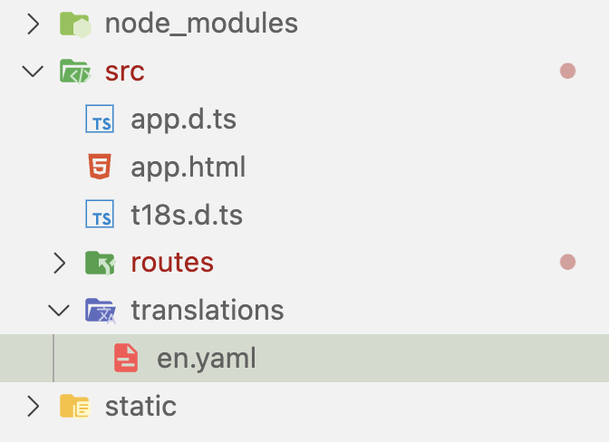
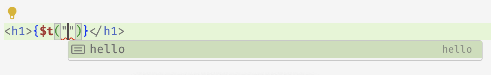
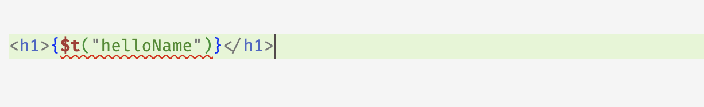
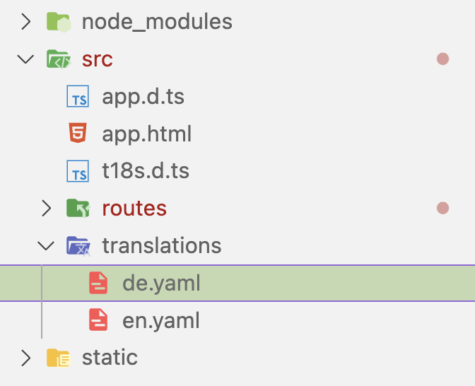

# Getting Started

## Installation

Since t18s is a vite-plugin, you can install it as a dev dependency:

```
pnpm i -D t18s
```

## Setup

Then add the plugin to your vite config:

```js
// vite.config.js
import { sveltekit } from "@sveltejs/kit/vite";
import { defineConfig } from "vite";
import { t18s } from "t18s";

export default defineConfig({
  plugins: [
    t18s({
      //Default options are shown
      translationsDir: "src/translations",
      dts: "src/t18s.d.ts",
    }),
    sveltekit(),
  ],
});
```

Then start the dev server with `(p)npm dev`.

You will notice that a new file will have been created. `src/t18s.d.ts`. This file contains the typescript definitions for your translations. Since it's generated by the dev-server, you can safely add it to your `.gitignore`.

## Your first translation

We can add a locale by creating a file in the `translationsDir`. Let's create `src/translations/en.yaml`:




```yaml
hello: Hello World!
```

Now we can use this translation in our code.
> MAKE SURE TO USE `$t18s` and not `t18s`

```svelte
<script>
    import { t } from "$t18s"
</script>

<h1>{$t("hello")}</h1>
```

You will notice that after typing `$t("` your IDE will suggest `"hello"` as a valid translation key. This is part of the magic of t18s.



Let's add another translation, this time with an argument.

```yaml
helloName: Hello {name}!
```

And update the svelte code.

```svelte
<h1>{$t("helloName")}</h1>
```

You will notice a warning in your IDE. This is because we are not passing the required `name` argument to the translation.



Let's fix that:

```svelte
<h1>{$t("helloName", { name: "Bartholomew" })}</h1>
```

Both the translation key and the argument name are validated by the typescript compiler. If you make a typo or forget to pass an argument, you will get an error.

`t18s` supports the full ICU MessageFormat syntax (including skeletons). You can read more about it [here](https://formatjs.io/docs/core-concepts/icu-syntax/).

## Try Hot Reloading

Here is a nice opportunity to try out hot reloading. Let's set the name in `helloName` dynamically using an input.

```svelte
<script>
    import { t } from "$t18s"
    let name = "John"
</script>

<h1>{$t("helloName", { name })}</h1>
<input bind:value={name} />
```

Open it in your browser and change the name in the input.
Then go back to `en.yaml` and edit the translation:

```yaml
helloName: Hello {name}! What a wonderful day!
```

You will notice that the translation is updated in the browser without a refresh, and the value in the input is not lost.

## Adding another locale
You can add another locale by creating another file in the `translationsDir`. Let's create `src/translations/de.yaml`:



```yaml
hello: Hallo Welt!
helloName: Hallo {name}!
```

That's it.

We can list the available locales using the `$locales` store. We can switch between them using the `setLocale` function.

```svelte
<script>
    import { t, $locales, setLocale } from "$t18s"
</script>

{#each $locales as locale}
    <button on:click={() => setLocale(locale)}>{locale}</button>
{/each}

<h1>{$t("hello")}</h1>
```
